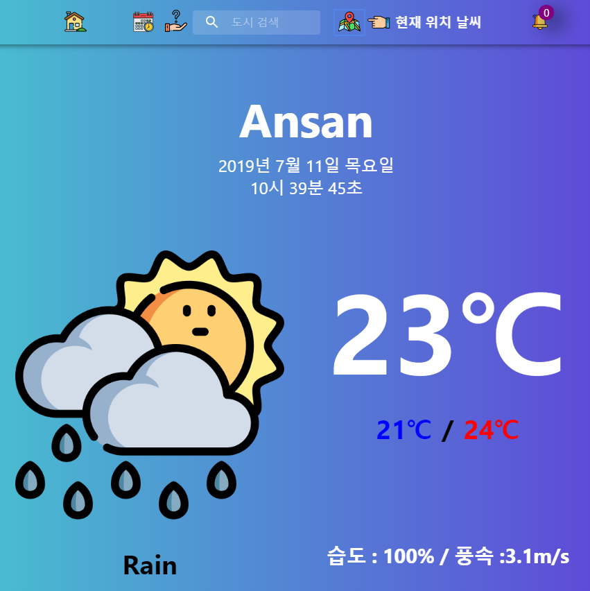
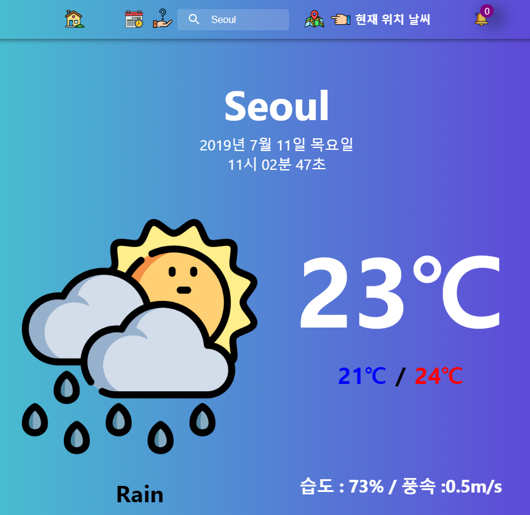
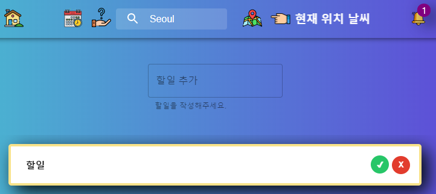
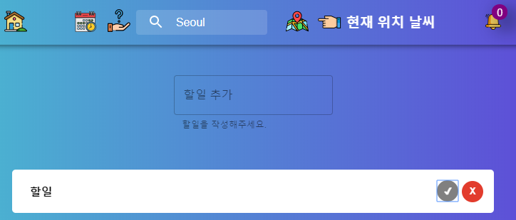
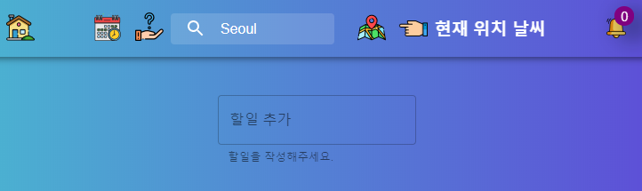
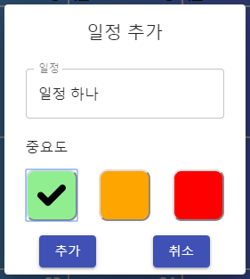
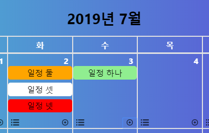
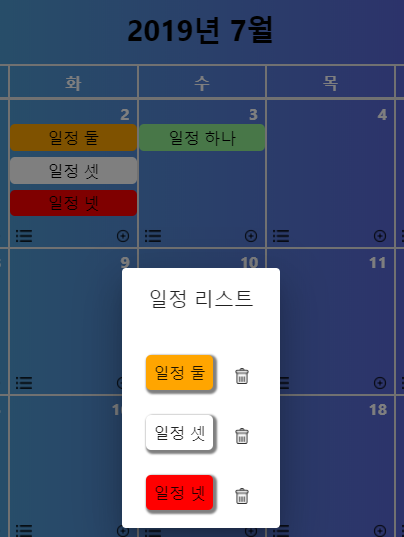
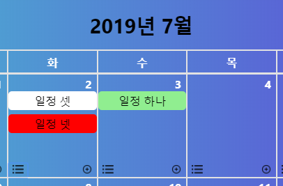

# 0. 프로젝트 개요
React, API, Local Storage, Redux의 기본 개념을 학습하고,
이를 바탕으로 제작한 개인 프로젝트입니다.

# 1. 프로젝트 설명
기본적으로 React를 활용하였습니다.

API : 날씨 데이터를 가져오기 위해 활용하였습니다. 
Local Storage : 달력 기능에서 일정 저장, 조회, 삭제 등을 위해 활용하였습니다. 
Redux : Todo-list에서 활용되었습니다.

# 2. 기능 설명
## 2-1. 날씨 조회
### 2-1-1. 현재 위치 날씨 조회
 
현재 위치 날씨 이미지 버튼을 클릭하면, 하단에 현재 위치의 날씨 정보가 출력됩니다.

### 2-1-2. 검색한 도시의 날씨 조회
 
네비게이션 바 가운데에 있는 TextField에 도시명을 검색하면 해당 도시의 날씨 정보가 하단에 출력됩니다.

## 2-2. Todo-list
### 2-2-1. Todo-list 추가
 
TextField 할일을 작성하고 'Enter' 키를 클릭하면, 바로 아래에 할일이 생성됩니다.

### 2-2-2. Todo-list 확인
 
체크 버튼을 클릭하게 되면 해당 div의 border, box-shadow가 변경되며 체크 버튼의 색은 회색이 됩니다. 
그리고 Redux를 활용해 오른쪽 위 알림의 개수도 1 감소시키게 됩니다.

### 2-2-3. Todo-list 삭제
 
삭제 버튼을 클릭하게 되면 해당 div가 없어지는 것은 물론, 오른쪽 위 알림 개수도 1 감소합니다.

## 2-3. Calendar
### 2-3-1. 일정 추가
 
더하기 버튼을 클릭 후, 일정을 추가할 수 있으며 중요도는 초록, 주황, 빨강과 기본값인 흰색까지 총 4가지가 존재합니다. 
아무것도 선택하지 않으면 흰색이 설정됩니다. 

### 2-3-2. 일정 조회
 
리스트 버튼을 클릭하면, 해당 날짜의 모든 일정을 확인할 수 있습니다.

### 2-3-3. 일정 삭제
 
삭제 버튼을 클릭하면, 해당 날짜에서 해당 일정이 삭제됩니다.
